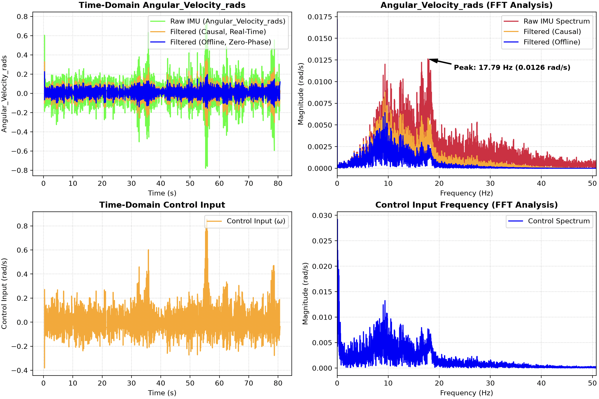

# 2 Wheels self balancing robot

A self-balancing robot modeled using a linearized state-space representation and implemented on a Raspberry Pi Pico with an IMU sensor and NEMA 17 stepper motors. The project includes the physical system modeling and core real-time control algorithm, along with Python-based tools for experimental data analysis, signal processing, and real-time visualization of system states and control signals.

---
## Robot in action

https://github.com/user-attachments/assets/70e26cd5-e973-4f93-8034-186bfde12b96

---
## 📌 Features

* **5D LQI State Control:** Regulates linear position ($x$), linear velocity ($\dot{x}$), pitch angle ($\theta$), pitch angular velocity ($\dot{\theta}$), and integrated position error ($x_{\text{int}}$) to guarantee zero steady-state position drift.
* **2D LQR State Control:** Reduced-order state controller regulating only pitch angle ($\theta$) and pitch angular velocity ($\dot{\theta}$).


**Note:** Switch between control algorithms by toggling the respective class instances/comments in `main.cpp`.


* **Real-Time plot:** Displays states of the system in real time and records to signal_records
* **Vibration analysis:** dsp.py provides a signal spectral analysis (FFT) of chosen state. I added a plot of filtered signal by 1st-order IIR with cutoff ($f_c = 10\text{ Hz}$), that also implemented on the IMU gyro output on (`hardware.cpp`)

---

## 🧮 Control Architecture & Physics

The robot is modeled as a non-minimum phase coupled inverted pendulum system operating at a $100\text{ Hz}$ control loop ($T_s = 10\text{ ms}$).

### 5D State Vector
$$\mathbf{x} = \begin{bmatrix} x & \dot{x} & \theta & \dot{\theta} & x_{\text{int}} \end{bmatrix}^T$$

Where $x_{\text{int}} = \int (x - x_{\text{ref}}) \, dt$.

### State-Space Representation

The system uses commanded motor angular acceleration as the control input ($u = \dot{\omega}_{\text{wheel}}$):

$$
\dot{\mathbf{x}} = \mathbf{A}\mathbf{x} + \mathbf{B}u
$$

$$
u = -\mathbf{K}\mathbf{x}
$$

$$
\mathbf{A} = \begin{bmatrix} 
0 & 1 & 0 & 0 & 0 \\ 
0 & 0 & 0 & 0 & 0 \\ 
0 & 0 & 0 & 1 & 0 \\ 
0 & 0 & \frac{M_{\text{tot}} g l_{\text{tot}}}{I_{\text{axle}}} & 0 & 0 \\ 
1 & 0 & 0 & 0 & 0 
\end{bmatrix}, \quad 
\mathbf{B} = \begin{bmatrix} 
0 \\ 
R_{\text{wheel}} \\ 
0 \\ 
-\frac{M_{\text{tot}} l_{\text{tot}} R_{\text{wheel}}}{I_{\text{axle}}} \\ 
0 
\end{bmatrix}
$$

* **Note:** 2D States is a reduced representation using the state vector: $\mathbf{x} = [\theta, \dot{\theta}]^T$.

---

## DSP Analysis:

The next graph represents the frequency analysis of the angular velocity:




The natural frequency of the robot is ~3-4 Hz, so considering the noise reduction and the potential phase-lag i decided to implement the 1st-order IIR filter with cutoff of 10 Hz

## 🚀 Quick Start

### 1. Embedded Firmware Setup
Build and flash the firmware using the Pico SDK from root:
```bash
mkdir build && cd build
cmake ..
make
cp 2Wheels_balanced.uf2 /Volumes/RPI-RP2
```

## Future updates:
* **Physical structure:** Raise the center of mass to increase axle rotational inertia, slowing down open-loop falling dynamics and improving control authority.
* **Electronic scheme:** Design a dedicated PCB o eliminate wiring clutter and reducing electrical noise. Also, adding a battery to the top could prevent external disturbance from the power cable (The current system really sensitive to it).
* **Algorithms:** Extending the robot capabilities to track references, to yaw in place, 2D space moving.
